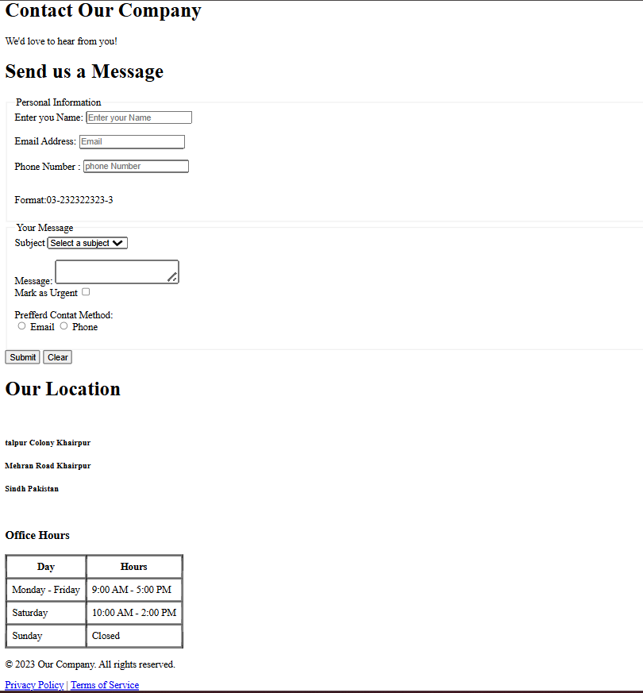

# Week 01 - HTML Basics 📘

## 📌 Task Overview
In this task, I practiced and strengthened my understanding of **basic HTML concepts**.  
I created a simple webpage that included:  
- Headings (`<h1> to <h6>`)  
- Paragraphs (`
`) 
-Tables 
- Forms (input fields, labels, buttons)  
- Links and basic text formatting   and Much More !!

## 🛠 Skills Learned
- Difference between various heading levels (`h1 - h6`)  
- Structuring content using paragraphs  
- Creating forms with text fields, password fields, checkboxes, and buttons  
- Adding semantic HTML elements for better readability  

## 📂 Files
- `index.html` → Contains the HTML code for the task  

## 📷 Output 
 

