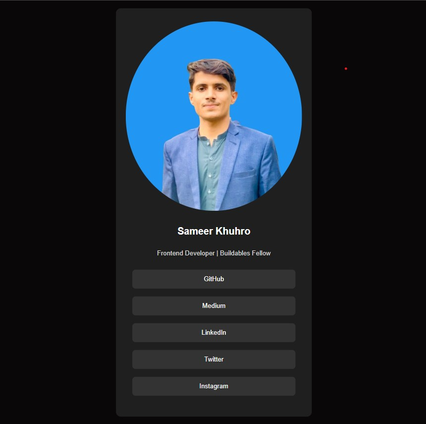

# 🚀 Fellowship Week 02 - Task 02  

## ✅ Task Completed  
Converted **Figma design** to a **fully responsive HTML & CSS webpage**.  

---

## 🎯 Overview  
This task was focused on **translating a given Figma design** into clean and structured **HTML & CSS code**.  
The goal was to practice turning UI/UX mockups into functional web pages while maintaining pixel-perfect accuracy.  

---

## 🛠️ Tech Stack  
- **HTML5** – Semantic and accessible markup  
- **CSS3** – Styling with Flexbox & responsive layouts  

---

## 📌 Features Implemented  
- Profile section with image, name, and location  
- Short bio/description section  
- Social media buttons (GitHub, Medium, LinkedIn, Twitter, Instagram)  
- Modern & minimal UI following the Figma design  
- Responsive layout for better viewing on multiple screen sizes  

---

## 📸 Output Preview  
### Figma Design → HTML & CSS Implementation  
- **Design Reference:** Provided in Figma  
- **Implementation:** Matches the original layout, colors, and typography  

---

